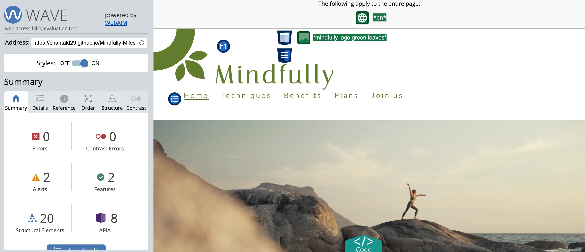

Link to live website here https://chantald29.github.io/Mindfully-MilestoneProject-1/index.html

## Table of contents
- [Introduction](#introduction)
- [Project Overview](#project-overview)
    - [Structure](#structure)
    - [Existing Features](#existing-features)
    - [Future Implementations](#future-implementations)
- [User Experience (UX)](#user-experience-ux)
    - [User Stories](#user-stories)
    - [Design](#design)
        - [Colour palette](#colour-palette)
        - [Typography](#typography)
    - [Wireframes](#wireframes)
 - [Technologies Used](#technologies-used)
	- [Languages Used](#languages-used)
	- [Programs and Websites Used](#programs-and-websites-used)
 - [Testing](#testing)
    - [Fixed Bugs](#fixed-bugs)
    - [Known Bugs](#known-bugs)
 - [Deployment](#deployment)
 - [Credits](#credits)
	 - [Content](#content)
	 - [Media](#media)
     - [Reference Material](#reference-material)
	 - [Acknowledgements](#acknowledgements)

# Introduction
For my first portfolio project I wanted to develop a website where users can find out more about Mindfulness (following Project Example Idea 3). The main goal here is to inform users about the benefits of Mindfulness and provide examples of techniques, so to turn Mindfulness into an everyday practice.  

There is also a page where users can sign up and subscribe to the newsletter or decide to subscribe to a premium plan and get access to mindfulness content like guided meditations and other useful tips. 

# Project Overview
## Structure
Mindfully is a 5 page website where each page has its own navigation link at the top of the page. The Home page is the default loading page. Users can easily navigate to other pages via the navigation links and buttons. A thank you page is also displayed once the user click on "Join" in the signup page, and it redirects to the homepage within 10 seconds. 

## Existing Features
- **Header**:
The header displays the logo (originally designed in Canva) and the menu bar. The different pages can be easily access from there or from the buttons below the introduction in the homepage.
- **Homepage**:
    - Introduction section
    Provides a general description of what mindfulness is.
    - Pillars section
    Some important advices and pillars of mindfulness are provided in this section.
- **Techniques page**:
Provides examples of the main techniques used to live a mindful lifestyle. The images, if clicked, are linked to their indivual description.
- **Benefits page**:
Provides information about the main benefits of mindfulness.
- **Signup (form)**:
Here the user can sign up and will receive a thank you message that redirects to the homepage 10 seconds after. 
- **Plans page**:
Here the user can find the available premium plans offered by Mindfully, as well as a prompt to start the free trial. 

## Future Implementations
- Add a new page for a *challenge*, or a *test* (as a form, with radios or checkboxes) to spark curiosity in the users and invite them to integrate mindfulness tips in their lifestyle.
- Create a page for each technique and link it them to each technique image in the gallery. I would also add a *dropdown menu* for the technique page listing all techniques so that users can easily navigate the techniques section.
- Create another page for *virtual events and meetups*. 
- Improve the overall *responsiveness* design on small screens, especially for the signup and plans pages (see section [Known Bugs](#known-bugs) )

# User Experience (UX)
Key information about the site for users: 
* What is Mindfulness?
* What are the benefits?
* Techniques and practice overview.
* Premium plans available to start practice it with Mindfully.
* Newsletter signup to keep posted about Mindfully. 

As a user, I want to:
* Find out about mindfulness
* Know the basics of mind techniques
* Be able to subscribe to a premium plan, or the newsletter 

As a developer, I want the site to:
* Be displayed clearly on different devices
* Be estetically appealing to spark interest in the user
* Be easy to navigate and provide helpful information
* Encourage users to subscribe to the free trial and eventually subscribe to a premium plan

## User Stories
- **Mark** is new to mindfulness. After a difficult period and some health issues, he has finally recovered and his doctor suggested he give mindfulness a try to live a helthier and less rushed lifestyle. His daugthers google the keyword "mindfulness" and "health" and run into Mindfully, where they can all find usedul information and start the free trial period.
- **Hillary** had practiced yoga and pilates almost everyday for a couple of years a while ago. Her life became a lot busier over the past few years...she regrets not practicing yoga or pilates anymore, and she's willing to take on a new challenge: she wants to be more mindful of her habits and decides to learn more about mindfulness.
- **Chris**  has always been into mindfulness and meditation: it is just the perfect way to manage her anxiety. He is used to reading about mindfulness and watching useful content on YouTube from his favorite channels. He is now browsing for free trials over the internet and decide on which service to subscribe. 

## Design 
### Colour Palette
When I started thinking about the design of the website, I pictured it would have some green in it as this colour conveys peace and calm. I later read by chance that some psychological studies have proved green to be soothing, with antidepressant properties: my choice was made. I chose images with warm colors to match the calming mood of the website.
The shade of green chosen in particolar is **HEX #A8C082** (RGB	168, 192, 130). 

Afte testing my deployed website on **Wave**, I realised the color was too light and didn't allow much contrast. To improve accessibility I then changed it to **HEX #627D2B** (RGB 98, 125, 43). This color passed the test on Wave and improved the overall contrast on the site. By doing so the **accessibility** score on lighthouse also improved (86 > 98).

### Typography

Italiana and Oswald from Google Fonts.

## Wireframes
The design of this website was first conceived using wireframes in Balsamiq. This helped me follow my original idea throughout the developing process. While some slight differences might be noticed between the wireframes here below and the final product, the basic structure and featured have been kept in mind during the process and are more or less the same as the original idea. 

### Homepage

### Techniques page

### Benefits page

### Plans page

### Join us (form) page

# Technologies Used
## Languages Used
HTML and CSS were used to develop this website. In the future Javascript could be used to add interesting features that could make the website more useful and interactive. 

## Programs and Websites Used
- Balsamiq - To create wireframes
- Google Fonts - To import the fonts used on the website
- Font Awesome - For the iconography on the website
- Google Dev Tools - To troubleshoot and test features, and solve issues with responsiveness and styling
- Git - For version control
- GitPod - To write, edit and save code
- GitHub - To save and store files for the website
- Font Awesome - To add icons
- Google Fonts - To import fonts
- Canva - To create the website logo
- Removebg - to remove images background
- Pixelied - to convert png/jpg files to webp format
- Color-hex - to convert hex to rgb 

# Testing
The website was tested on all validators, including Wave for accessibility matters and Lighthouse for overall performance. During the firs test it emerged that it would be better to increase accessibility by changing the main color (see [Colour palette](#colour-palette)for more details) and therefore increasing the overall contrast. One other important thing to fix was the overall performance score: this was done by removing all images in png or jpg format and converting them into webp.

## Fixed Bugs
- Benefits page title (h2) not detaching from header

How it was fixed:
The issue here was in the header. After close observation it merged that the header had no height value, which caused it to encroach onto the h2. That's why the two overlapped. By targeting the header and adding some volume, I was then able to center the h2 as wished, and from there resize the page elements with media queries. 

- "Join us" remains underlined when not selected (in Plans page)

How it was fixed:
Since the basic html structured was copied from the "Join us" page, I checked the menu bar code first. In effect, class="active" was still within the "Join us" tag instead of the actual page "Plans". Copied and pasted class="active" to "Plans" tag was a quick fix for this bug. 

- Text not centered in form

How it was fixed:
Thanks to the Dev Tool I was able to identify the problem in display:block and changed to display:inline.

## Known Bugs
-Page zoomed out or zommed in on small displays (Plans and Signup)

When I checked the website on my iPhone (model 14 Pro, editing on DevTool with the iPhone 12 Pro preview) I realised these two pages wren't displayed like the others, but rather zoomed in or zoomed out. The user would then have to resize the page by pinching, which isn’t optimal. The tutor I consulted pointed me in the right direction advising it might be a **viewport** issue. 
This was fixed by adding a meta tag in the head of those pages with content="initial-scale=0.5".

This represented a quick solution for the above mentioned issue, as the page is now completely displayed with no need to zoom and resize it. However, there is still one bug, namely the menu bar displayed differently (smaller) when compared to all the other pages across the website (this only happens on screen sizes below 950px). In the future I would like to improve the responsive design on small screens: I tried my best to achieve an acceptable result, however since the deadline approached I realized I couldn’t polish it as wished. 

# Deployment
To deploy the live website GitHub Pages was used.
The steps are the following: 
1. Log in to GitHub 
2. Locate the repository for the project you want to deploy
3. Click on the Settings link
4. Click on the Pages link
5. In the Sources section > chose "main" from the dropdown select branch menu > select "root" from the dropdown select folder menu
6. Click save and your live website will be now deployed at the URL indicated. 

# Credits
## Content
Texts and content are based on the following reference websites:
- https://www2.hse.ie/mental-health/self-help/activities/mindfulness/
- https://www.mindful.org/meditation/mindfulness-getting-started/
- https://www.mayoclinic.org/healthy-lifestyle/consumer-health/in-depth/mindfulness-exercises/art-20046356
- https://www.aware.ie/information/mindfulness/ 

## Media
Images and videos taken from pexel free for usage with no copyright. I would like to acknowledge the following creators for releasing amazing free content that matched perfectly my website’s idea.
- https://www.pexels.com/video/woman-doing-yoga-over-a-rock-7580229/
- https://www.pexels.com/photo/faceless-woman-reading-book-on-comfortable-bed-at-home-6588939/
- https://www.pexels.com/photo/reflective-woman-meditating-in-lotus-pose-with-namaste-hands-4793357/
- https://www.pexels.com/photo/woman-and-dog-walking-at-woods-1612847/
- https://www.pexels.com/photo/photo-of-woman-laying-on-ground-3759659/
- https://www.pexels.com/photo/smiling-ethnic-gardener-with-plant-on-sunny-day-6231870/
- https://www.pexels.com/photo/flexible-sportswoman-doing-yoga-exercise-at-home-4498158/
- https://www.pexels.com/photo/bed-of-white-petaled-flower-605494/
- https://www.pexels.com/photo/photo-of-an-elderly-woman-meditating-8939951/

## Reference Material
- w3schools https://www.w3schools.com/tags/tag_span.asp 
- GitHub Docs https://docs.github.com/en/get-started/writing-on-github/getting-started-with-writing-and-formatting-on-github/basic-writing-and-formatting-syntax
- Plans page cards https://www.youtube.com/watch?v=Oa9LTDR9ugU&t=456s 
- Expanding gallery https://www.youtube.com/watch?v=ly4Dqz2Mz8s
- Tips for responsive design https://www.youtube.com/watch?v=VQraviuwbzU&t=568s 
- Walkthrough "Love Running" by Code Academy (especially for the header, footer, right-bout, left-about and center-about parts)

### Readme file
Kera-cudmore/readme-examples https://github.com/kera-cudmore/readme-examples and video from Code Institue https://www.youtube.com/watch?v=XbYJ4VlhSnY&t=1639s 
- GitHub Docs https://docs.github.com/en 
- https://www.youtube.com/watch?v=E6NO0rgFub4 
- https://www.youtube.com/watch?v=Ljj1wGFJqPY 
- https://www.youtube.com/watch?v=XbYJ4VlhSnY 
- https://www.youtube.com/watch?v=CEjaKXYeaJU

## Acknowledgements
I would like to acknowledge my mentor Graeme Taylor for his support and guidance from the beginning of the course and for his precious advices for my project. Thank you for always pointing me in the right direction. I would also like to thank the tutors at the Code Institute for their great help: they provided tips and explanations that helped me figure out a solution to fix the bugs I had. Thanks to Joshua and Joanne fo that. 
